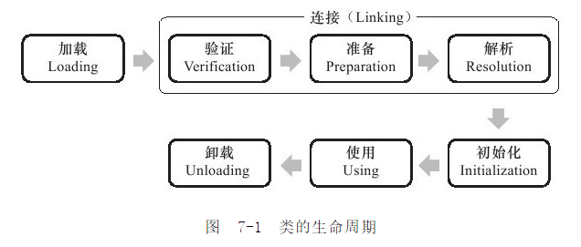

# 虚拟机类加载机制

## 概述

### 虚拟机类加载机制的概念

虚拟机把描述类的数据从Class文件加载到内存，并对数据进行校验、转换解析和初始化。最终形成可以被虚拟机最直接使用的Java类型的过程就是虚拟机的类加载机制。

### Java语言的动态加载和动态连接

另外需要注意的很重要的一点是：**Java语言中类型的加载连接以及初始化过程都是在程序运行期间完成的**，这种策略虽然会使类加载时稍微增加一些性能开销，但是会为Java应用程序提供高度的 **灵活性**。Java里天生就可以动态扩展语言特性就是依赖运行期间动态加载和动态连接这个特点实现的。比如，如果编写一个面向接口的程序，可以等到运行时再指定其具体实现类。

## 类加载时机

类从被加载到虚拟机内存到卸出内存为止，它的整个生命周期包括：



虚拟机规范严格规定了有且只有五种情况必须立即对类进行“初始化”：

* 使用 `new` 关键字实例化对象的时候、读取或设置一个类的静态字段的时候，已经调用一个类的静态方法的时候。
* 使用 `java.lang.reflect` 包的方法对类进行反射调用的时候，如果类没有初始化，则需要先触发其初始化。
* 当初始化一个类的时候，如果发现其父类没有被初始化就会先初始化它的父类。
* 当虚拟机启动的时候，用户需要指定一个要执行的主类（就是包含main()方法的那个类），虚拟机会先初始化这个类。
* 使用Jdk1.7动态语言支持的时候的一些情况。

而对于接口，当一个接口在初始化时，并不要求其父接口全部都完成了初始化，只有在真正使用到父接口时（如引用父接口中定义的常量）才会初始化。

所有引用类的方式都不会触发初始化称为被动引用，三个被动引用例子：

1. 通过子类引用父类静态字段，不会导致子类初始化；

```java

```