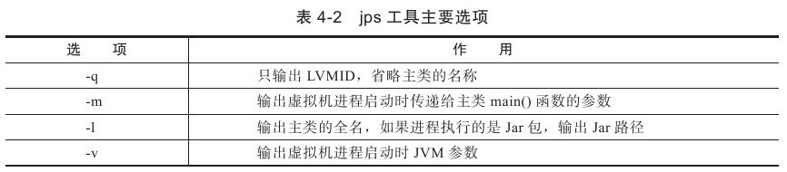
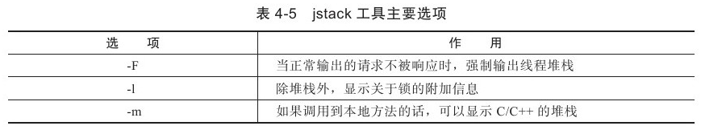

# 虚拟机性能监控与故障处理工具

## JDK命令行工具

名称    |   主要作用
--- |   ---
`jps` |   JVM Process Status Tool, 显示指定系统内所有的HotSpot虚拟机进程
`jstat`   |   JVM Statistics Monitoring Tool, 用于收集HotSpot虚拟机各方面的运行数据。
`jinfo`   |   Configuration Info forJava, 显示虚拟机配置信息
`jmap`    |   Memory Map for Java, 生成虚拟机的内存转储快照（heapdump文件）
`jhat`    |   JVM Heap Dump Browser, 用于分析heapdump文件，它会建立一个HTTP/HTML服务器，让用户可以在浏览器上查看分析结果
`jstack`  |   Stack Trace forJava, 显示虚拟机的线程快照

###  `jps`: 虚拟机进程状况工具

可以列出正在运行的虚拟机进程，并显示虚拟机执行主类名称以及这些进程的本地虚拟机唯一ID



### `jstat`: 虚拟机统计信息监视工具

jstat（JVM Statistics Monitoring Tool） 使用于监视虚拟机各种运行状态信息的命令行工具。 它可以显示本地或者远程（需要远程主机提供RMI支持）虚拟机进程中的类信息、内存、垃圾收集、JIT编译等运行数据，在没有GUI，只提供了纯文本控制台环境的服务器上，它将是运行期间定位虚拟机性能问题的首选工具。


### `jinfo`: Java 配置信息工具

jinfo（Configuration Info for Java） 的作用是实时地查看和调整虚拟机各项参数。使用 `jps` 命令的 `-v` 可以查看虚拟机启动时显式指定的参数列表，但如果想知道未被显式指定的参数的系统默认值，可以使用 `jinfo` 的 `-flag` 选项进行查询，`jinfo` 还可以使用 `-sysprops` 选项把虚拟机进程的 `System.getProperties()` 的内容打印出来。


### `jmap`: Java 内存映像工具

jmap（Memory Map for Java）命令用于生成堆转储快照。 如果不使用 `jmap` 命令，要想获取Java堆转储，可以使用“**-XX:+HeapDumpOnOutOfMemoryError**”参数，可以让虚拟机在 OOM 异常出现之后自动生成dump文件，Linux命令下可以通过 `kill -3` 发送进程退出信号也能拿到dump文件。


```shell
jmap -dump:format=b,file=eclipse.bin 3500
```

### `jstack`: Java 堆栈跟踪工具

`jstack`（Stack Trace for Java）命令用于生成虚拟机当前时刻的线程快照。线程快照就是当前虚拟机内每一条线程正在执行的方法堆栈的集合。

生成线程快照的目的主要是定位线程长时间出现停顿的原因，如线程间死锁、死循环、请求外部资源导致的长时间等待等都是导致线程长时间停顿的原因。线程出现停顿的时候通过`jstack` 来查看各个线程的调用堆栈，就可以知道没有响应的线程到底在后台做些什么事情，或者在等待些什么资源。



