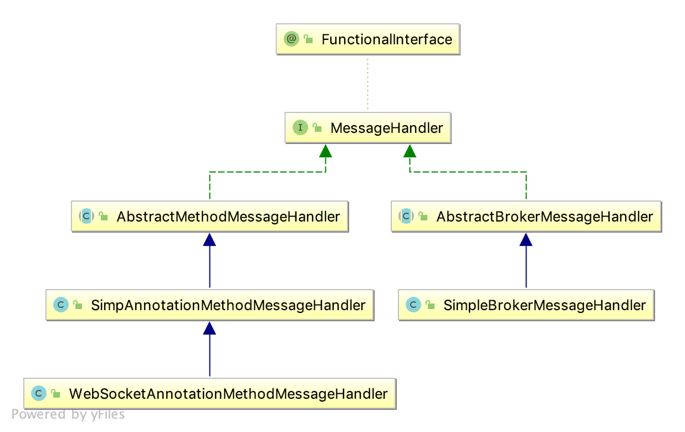

# Spring Boot With Websocket

## 消息发送流程

由客户端向服务器发送消息消息时，`AbstractMethodMessageHandler` 会用来处理拥有 `@MessageMapping` 注解，且符合目标路径的方法； 并通过 `@SendTo` 或 `@SendToUser` 注解发送处理后的信息，最终所有信息会通过 `SimpleBrokerMessageHandler` 的 `sendMessageToSubscribers` 方法统一发送。

`MessageHandler` 作为处理“消息”（`Message`）基本接口，既用来处理进站消息，也用用于处理出站消息。



- `SimpAnnotationMethodMessageHandler` 的 `handleMatch` 用于处理入站消息，并将结果发送；
- `SimpleBrokerMessageHandler` 的 `sendMessageToSubscribers` 方法用于实际发送消息；

所有的进站与出站消息都会通过 `ExecutorSubscribableChannel` 的 `SendTask` 内部类统一处理，其内部属性 `messageHandler` 可以根据不同的接口实现，用于处理进站或出站消息。

```java
private class SendTask implements MessageHandlingRunnable {

    private final Message<?> inputMessage;

    private final MessageHandler messageHandler;

    private int interceptorIndex = -1;

    public SendTask(Message<?> message, MessageHandler messageHandler) {
        this.inputMessage = message;
        this.messageHandler = messageHandler;
    }

    @Override
    public Message<?> getMessage() {
        return this.inputMessage;
    }

    @Override
    public MessageHandler getMessageHandler() {
        return this.messageHandler;
    }

    @Override
    public void run() {
        Message<?> message = this.inputMessage;
        try {
            message = applyBeforeHandle(message);
            if (message == null) {
                return;
            }
            this.messageHandler.handleMessage(message);
            triggerAfterMessageHandled(message, null);
        }
        // 省略异常捕捉
    }

    @Nullable
    private Message<?> applyBeforeHandle(Message<?> message) {
        // ...
    }

    private void triggerAfterMessageHandled(Message<?> message, @Nullable Exception ex) {
        // ...
    }
}
```

## 处理入站信息

在处理入站消息时，`MessageHandler` 使用的是 `WebSocketAnnotationMethodMessageHandler` 实现，调用其父类 `AbstractMethodMessageHandler` 的 `handleMessage` 方法。

```java
@Override
public void handleMessage(Message<?> message) throws MessagingException {
    String destination = getDestination(message);
    if (destination == null) {
        return;
    }
    String lookupDestination = getLookupDestination(destination);
    if (lookupDestination == null) {
        return;
    }

    MessageHeaderAccessor headerAccessor = MessageHeaderAccessor.getMutableAccessor(message);
    headerAccessor.setHeader(DestinationPatternsMessageCondition.LOOKUP_DESTINATION_HEADER, lookupDestination);
    headerAccessor.setLeaveMutable(true);
    message = MessageBuilder.createMessage(message.getPayload(), headerAccessor.getMessageHeaders());

    // 省略日志代码

    handleMessageInternal(message, lookupDestination);
    headerAccessor.setImmutable();
}
```

在 `handleMessageInternal` 中会调用 `handleMatch` 方法拦截并处理请求

```java
protected void handleMatch(T mapping, HandlerMethod handlerMethod, String lookupDestination, Message<?> message) {
    // 省略日志代码
    handlerMethod = handlerMethod.createWithResolvedBean();
    InvocableHandlerMethod invocable = new InvocableHandlerMethod(handlerMethod);
    if (this.handlerMethodLogger != null) {
        invocable.setLogger(this.handlerMethodLogger);
    }
    invocable.setMessageMethodArgumentResolvers(this.argumentResolvers);
    try {
        // 实际处理 controller 加 @MessageMapping 处理方法
        Object returnValue = invocable.invoke(message);
        MethodParameter returnType = handlerMethod.getReturnType();
        if (void.class == returnType.getParameterType()) {
            return;
        }
        if (returnValue != null && this.returnValueHandlers.isAsyncReturnValue(returnValue, returnType)) {
            ListenableFuture<?> future = this.returnValueHandlers.toListenableFuture(returnValue, returnType);
            if (future != null) {
                future.addCallback(new ReturnValueListenableFutureCallback(invocable, message));
            }
        } else {
            // 调用 HandlerMethodReturnValueHandlerComposite#handleReturnValue 来处理返回值
            this.returnValueHandlers.handleReturnValue(returnValue, returnType, message);
        }
    }

    // 省略异常捕捉
}
```

`handleReturnValue` 方法最终会调用 `SendToMethodReturnValueHandler` 中 `handleReturnValue` 方法发送处理结果。

```java
@Override
public void handleReturnValue(@Nullable Object returnValue, MethodParameter returnType, Message<?> message)
        throws Exception {

    if (returnValue == null) {
        return;
    }

    MessageHeaders headers = message.getHeaders();
    String sessionId = SimpMessageHeaderAccessor.getSessionId(headers);
    DestinationHelper destinationHelper = getDestinationHelper(headers, returnType);

    // 处理 SendToUser 注解
    SendToUser sendToUser = destinationHelper.getSendToUser();
    if (sendToUser != null) {
        boolean broadcast = sendToUser.broadcast();
        String user = getUserName(message, headers);
        if (user == null) {
            if (sessionId == null) {
                throw new MissingSessionUserException(message);
            }
            user = sessionId;
            broadcast = false;
        }
        String[] destinations = getTargetDestinations(sendToUser, message, this.defaultUserDestinationPrefix);
        for (String destination : destinations) {
            destination = destinationHelper.expandTemplateVars(destination);
            if (broadcast) {
                this.messagingTemplate.convertAndSendToUser(
                        user, destination, returnValue, createHeaders(null, returnType));
            }
            else {
                this.messagingTemplate.convertAndSendToUser(
                        user, destination, returnValue, createHeaders(sessionId, returnType));
            }
        }
    }

    // 处理 SendTo 注解
    SendTo sendTo = destinationHelper.getSendTo();
    if (sendTo != null || sendToUser == null) {
        String[] destinations = getTargetDestinations(sendTo, message, this.defaultDestinationPrefix);
        for (String destination : destinations) {
            destination = destinationHelper.expandTemplateVars(destination);
            this.messagingTemplate.convertAndSend(destination, returnValue, createHeaders(sessionId, returnType));
        }
    }
}
```

其中 `convertAndSendToUser` 和 `convertAndSend` 最终都会调用 `AbstractMessageSendingTemplate` 中的 `convertAndSend` 方法。

```java
@Override
public void convertAndSend(D destination, Object payload, @Nullable Map<String, Object> headers,
        @Nullable MessagePostProcessor postProcessor) throws MessagingException {

    Message<?> message = doConvert(payload, headers, postProcessor);
    send(destination, message);
}
```

`send` 方法会调用 `SimpMessagingTemplate` 中的 `doSend` 方法，`doSend` 会调用其中的 `sendInternal` 方法，`sendInternal` 调用 `AbstractMessageChannel` 中的 `send` 方法，最终通过 `ExecutorSubscribableChannel` 中的 `sendInternal` 发送消息。

## 处理出站消息

在上一步中，消息还没有实际发送出去，只是交由线程池处理，仍然会用到 `MessageHandler`，只是这里会使用 `SimpleBrokerMessageHandler` 实现，调用其父类 `AbstractBrokerMessageHandler` 的 `handleMessage` 方法。

`handleMessage` 会调用 `SimpleBrokerMessageHandler` 中的 `handleMessageInternal` 方法。

```java
@Override
	protected void handleMessageInternal(Message<?> message) {
		MessageHeaders headers = message.getHeaders();
		SimpMessageType messageType = SimpMessageHeaderAccessor.getMessageType(headers);
		String destination = SimpMessageHeaderAccessor.getDestination(headers);
		String sessionId = SimpMessageHeaderAccessor.getSessionId(headers);

		updateSessionReadTime(sessionId);

		if (!checkDestinationPrefix(destination)) {
			return;
		}

		if (SimpMessageType.MESSAGE.equals(messageType)) {
            logMessage(message);

            // 实际发送方法
			sendMessageToSubscribers(destination, message);
        }
        // 根据 Message 类别分别处理
		else if (SimpMessageType.CONNECT.equals(messageType)) {
			logMessage(message);
			if (sessionId != null) {
				long[] heartbeatIn = SimpMessageHeaderAccessor.getHeartbeat(headers);
				long[] heartbeatOut = getHeartbeatValue();
				Principal user = SimpMessageHeaderAccessor.getUser(headers);
				MessageChannel outChannel = getClientOutboundChannelForSession(sessionId);
				this.sessions.put(sessionId, new SessionInfo(sessionId, user, outChannel, heartbeatIn, heartbeatOut));
				SimpMessageHeaderAccessor connectAck = SimpMessageHeaderAccessor.create(SimpMessageType.CONNECT_ACK);
				initHeaders(connectAck);
				connectAck.setSessionId(sessionId);
				if (user != null) {
					connectAck.setUser(user);
				}
				connectAck.setHeader(SimpMessageHeaderAccessor.CONNECT_MESSAGE_HEADER, message);
				connectAck.setHeader(SimpMessageHeaderAccessor.HEART_BEAT_HEADER, heartbeatOut);
				Message<byte[]> messageOut = MessageBuilder.createMessage(EMPTY_PAYLOAD, connectAck.getMessageHeaders());
				getClientOutboundChannel().send(messageOut);
			}
		}
		else if (SimpMessageType.DISCONNECT.equals(messageType)) {
			logMessage(message);
			if (sessionId != null) {
				Principal user = SimpMessageHeaderAccessor.getUser(headers);
				handleDisconnect(sessionId, user, message);
			}
		}
		else if (SimpMessageType.SUBSCRIBE.equals(messageType)) {
			logMessage(message);
			this.subscriptionRegistry.registerSubscription(message);
		}
		else if (SimpMessageType.UNSUBSCRIBE.equals(messageType)) {
			logMessage(message);
			this.subscriptionRegistry.unregisterSubscription(message);
		}
	}
```

## 传递参数

1. 在消息头中加参数

```js
stompClient.send("/app/hello", { test: "greetings" }, name);
```

在 Java 代码中可通过 `@Header` 或 `@Headers` 注解获取

```java
@Controller
public class ChatController {

	@Autowired
	private SimpMessagingTemplate template;

	@MessageMapping("/hello")
    public String send(String message,
            @Header("test") String topic,
			@Headers Map<String, Object> headers) {

		System.out.println("message==" + message);
		System.out.println("topic==" + topic);
		System.out.println("headers==" + headers);

		template.convertAndSend("/topic/" + topic, message);
		return "";
	}
}
```

2. 在路径中添加参数

```js
stompClient.send("/app/hello/aty/greetings", {}, name);
```

使用 `@DestinationVariable` 进行接受

```java
@Controller
public class Chat2Controller {
	@Autowired
	private SimpMessagingTemplate template;

	// 如果只有一个模板变量,那么可以直接使用@DestinationVariable
	@MessageMapping("/hello/{userName}/{topic}")
    public String send(String message,
        @DestinationVariable("topic") String topic,
        @DestinationVariable(value="userName") String userName) {
		System.out.println("message=="+message);
		System.out.println("topic=="+topic);
		System.out.println("userName=="+userName);

		template.convertAndSend("/topic/"+topic, message);
		return "";
	}
}
```

## 获取 `HttpSession`

注册一个握手拦截器 `HttpSessionHandshakeInterceptor`,内部的 `beforeHandshake` 方法在握手之前将 `Session` 已进行保存。

```java
public boolean beforeHandshake(ServerHttpRequest request,
        ServerHttpResponse response,
        WebSocketHandler wsHandler,
        Map<String, Object> attributes) throws Exception {

    HttpSession session = getSession(request);
    if (session != null) {
        if (isCopyHttpSessionId()) {
            attributes.put(HTTP_SESSION_ID_ATTR_NAME, session.getId());
        }
        Enumeration<String> names = session.getAttributeNames();
        while (names.hasMoreElements()) {
            String name = names.nextElement();
            if (isCopyAllAttributes() || getAttributeNames().contains(name)) {
                attributes.put(name, session.getAttribute(name));
            }
        }
    }
    return true;
}
```

可通过注入 `SimpMessageHeaderAccessor` 获取相关参数。

```java
@MessageMapping("/chat")
public void chat(SimpMessageHeaderAccessor headerAccessor, @RequestBody ChatMessage chatMessage) {
    User user = (User) headerAccessor.getSessionAttributes().get("user");  // right
    chatService.chat(user,chatMessage);
}
```
