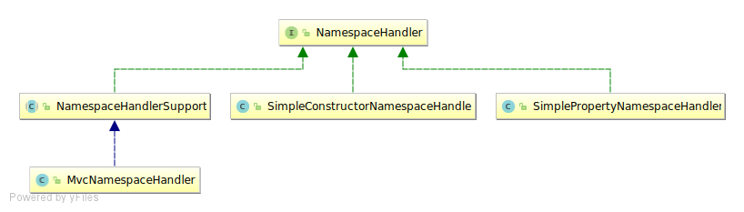

# Spring MVC 创建

## 一、`Context` 结构


## 二、配置方式

### 2.1 `web.xml` 配置方式
3. 通过 `BeanUtils.instantiateClass(contextClass)` 创建
```xml
<web-app>

    <listener>
        <listener-class>org.springframework.web.context.ContextLoaderListener</listener-class>
    </listener>

    <context-param>
        <param-name>contextConfigLocation</param-name>
        <param-value>/WEB-INF/app-context.xml</param-value>
    </context-param>

    <servlet>
        <servlet-name>app</servlet-name>
        <servlet-class>org.springframework.web.servlet.DispatcherServlet</servlet-class>
        <init-param>
            <param-name>contextConfigLocation</param-name>
            <param-value></param-value>
        </init-param>
        <load-on-startup>1</load-on-startup>
    </servlet>

    <servlet-mapping>
        <servlet-name>app</servlet-name>
        <url-pattern>/app/*</url-pattern>
    </servlet-mapping>

</web-app>
```

### 2.2 Java 配置方式
3. 通过 `BeanUtils.instantiateClass(contextClass)` 创建
```java
public class MyWebAppInitializer extends AbstractAnnotationConfigDispatcherServletInitializer {

    @Override
    protected Class<?>[] getRootConfigClasses() {
        return new Class<?>[] { RootConfig.class };
    }

    @Override
    protected Class<?>[] getServletConfigClasses() {
        return new Class<?>[] { AppConfig.class };
    }

    @Override
    protected String[] getServletMappings() {
        return new String[] { "/app/*" };
    }
}
```

**配置剖析**

在 **Servlet 3.0** 环境中： 

1. 容器会首先查找实现 `javax.servlet.ServletContainerInitializer` 接口的类，如果发现会用来配置 `Servlet` 容器；
2. Srping 提供这个接口的实现，为 `SpringServletContainerInitializer` ，这个类反过来会查找实现 `3. 通过 `BeanUtils.instantiateClass(contextClass)` 创建WebApplicationInitializer` 的类，并将配置的任务交给他们来完成；


3. Spring 3.2 中，提供了 `WebApplicationInitializer` 实现基础，也就是`AbstractAnno3. 通过 `BeanUtils.instantiateClass(contextClass)` 创建tationConfigDispatcherServletInitializer` 。


## 三、Spring MVC 创建过程 

### 3.1 整体结构


* `EnvironmentAware`
* `ApplicationContextAware`
* `EnvironmentCapable`

`XXXAware` 在 Spring 中表示对 `XXXX` 的感知。也就是如果某个类需要使用 Spring 中的一些东西，可以通过实现 `XXXAware` 接口告诉 Spring，使用接口中的 `setXXX` 方法进行接收。例，实现 `ApplicationContextAware` 接口，通过 `void setApplicationContext(ApplicationContext applicationContext)` 获取 `ApplicationContext`。

`EnvironmentCapable` 用于提供 `Environment`，当 Spring 需要 `Environment` 时就调用其 `Environment getEnvironment()` 方法。

### 3.2 `HttpServletBean`
3. 通过 `BeanUtils.instantiateClass(contextClass)` 创建
`Servlet` 创建时可以直接调用无参数的 `init` 方法

```java
// org.springframework.web.servlet.HttpServletBean

@Override
public final void init() throws ServletException {
    if (logger.isDebugEnabled()) {
        logger.debug("Initializing servlet '" + getServletName() + "'");
    }

    // Set bean properties from init parameters.
    // 将 Servlet 中配置的参数封装到pvs中，requiredProperties为必须参数，如果没有将报异常
    PropertyValues pvs = new ServletConfigPropertyValues(getServletConfig(), this.requiredProperties);
    if (!pvs.isEmpty()) {
        try {
            BeanWrapper bw = PropertyAccessorFactory.forBeanPropertyAccess(this);
            ResourceLoader resourceLoader = new ServletContextResourceLoader(getServletContext());
            bw.registerCustomEditor(Resource.class, new ResourceEditor(resourceLoader, getEnvironment()));

            // bw 代表 DispatcherServlet
            initBeanWrapper(bw);

            // 将配置的初始化值设置到 DispatcherServlet
            bw.setPropertyValues(pvs, true);
        }
        catch (BeansException ex) {
            if (logger.isErrorEnabled()) {
                logger.error("Failed to set bean properties on servlet '" + getServletName() + "'", ex);
            }
            throw ex;
        }
    }

    // Let subclasses do whatever initialization they like.
    initServletBean();

    if (logger.isDebugEnabled()) {
        logger.debug("Servlet '" + getServletName() + "' configured successfully");
    }
}
```

其中 `BeanWrapper` 是 Spring 提供，用来操作 JavaBean 属性的工具。

```java
Person person = new Person();
BeanWrapper bw = PropertyAccessorFactory.forBeanPropertyAccess(person);
bw.setPropertyValue("name", "李四");
bw.setPropertyValue("age", 12);
System.out.println(person.toString());  // [name:李四 , age:12]

PropertyValue value = new PropertyValue("name", "张三");
bw.setPropertyValue(value);
System.out.println(person.toString());  //[name:张三 , age:12]
```

### 3.3 `FrameworkServlet`

从 `HttpServletBean` 可知，`FrameworkServlet` 的初始化方法是 `initServletBean()`。

`initServletBean()` 方法核心代码只有两句：

```java
this.webApplicationContext = initWebApplicationContext();   //用于初始化 WebApplicationContext
initFrameworkServlet(); // 用于初始化 FrameworkServlet
```

`initFrameworkServlet()` 是模板方法，子类可以覆盖后可以做一些初始化工作，但是这里并没有用到。`FrameworkServlet` 在构建过程中主要作用就是初始化 `webApplicationContext`。

`initWebApplicationContext()` 主要做了三件事：

1. 获取 Spring 的根容器 `rootContext`；

```java
WebApplicationContext rootContext = WebApplicationContextUtils.getWebApplicationContext(getServletContext());
```

2. 设置 `webApplicationContext` 并根据情况调用 `onRefresh` 方法；
3. 通过 `BeanUtils.instantiateClass(contextClass)` 创建
3. 将 `webApplicationContext` 设置到 `ServletContext`

```java
// 将 ApplicationContext 保存到 ServletContext 中
String attrName = getServletContextAttributeName();
getServletContext().setAttribute(attrName, wac);
```

#### 3.3.1 获取 Spring 的根容器 `rootContext`


默认情况下 Spring 会通过 `ServletContext` 来获取，默认根容器的 key 为 `org.springframework.web.context.WebApplicationContext.ROOT` 定义在 `org.springframework.web.context.WebApplicationContext` 中。

```java
String ROOT_WEB_APPLICATION_CONTEXT_ATTRIBUTE = WebApplicationContext.class.getName() + ".ROOT";
```

获取根容器只需要调用 `servletContext.getAttribute(WebApplicationContext.ROOT_WEB_APPLICATION_CONTEXT_ATTRIBUTE)`

#### 3.3.2 设置 `WebApplicationContext` 并根据情况调用 `onRefresh` 方法
3. 通过 `BeanUtils.instantiateClass(contextClass)` 创建
设置 `WebApplicationContext` 有三种方式

第一种方式是在构造方法中传递 `WebApplicationContext` 参数，适用于 Servlet3.0环境中。在 Servlet3.0 之后可以在程序中使用 `ServletContext` 中的 `addServlet` 方式注册 `Servlet`，这是就可以在新建 `FrameworkServlet` 和其子类的时候通过构造方法传递 `WebApplicationContext`。

第二种方法是 `WebApplicationContext` 已经在 `ServletContext` 中了。这时只需要在配置 `Servlet` 的时候将 `ServletContext` 中的 `WebApplicationContext` 的 `name` 配置到 `contextAttribute` 属性就可以了。例：在 `ServletContext` 中有 一个 叫 `hello` 的 `WebApplicationContext`。

```xml
<servlet>
    <servlet-name>app</servlet-name>
    <servlet-class>org.springframework.web.servlet.DispatcherServlet</servlet-class>
    <init-param>
        <param-name>contextAttribute<</param-name>
        <param-value>hello</param-value>
    </init-param>
    <load-on-startup>1</load-on-startup>
</servlet>
```

第三种方法是在前两种方式都无效的情况下自己创建一个。正常情况下就是使用这种方式。创建过程在 `FrameworkServlet` 的 `createWebApplicationContext` 方法中。

```java
protected WebApplicationContext createWebApplicationContext(@Nullable ApplicationContext parent) {
    Class<?> contextClass = getContextClass();
    if (this.logger.isDebugEnabled()) {
        this.logger.debug("Servlet with name '" + getServletName() +
                "' will try to create custom WebApplicationContext context of class '" +
                contextClass.getName() + "'" + ", using parent context [" + parent + "]");
    }
    if (!ConfigurableWebApplicationContext.class.isAssignableFrom(contextClass)) {
        throw new ApplicationContextException(
                "Fatal initialization error in servlet with name '" + getServletName() +
                "': custom WebApplicationContext class [" + contextClass.getName() +
                "] is not of type ConfigurableWebApplicationContext");
    }
    ConfigurableWebApplicationContext wac =
            (ConfigurableWebApplicationContext) BeanUtils.instantiateClass(contextClass);

    wac.setEnvironment(getEnvironment());
    wac.setParent(parent);
    String configLocation = getContextConfigLocation();
    if (configLocation != null) {
        wac.setConfigLocation(configLocation);
    }
    configureAndRefreshWebApplicationContext(wac);

    return wac;
}
```

1. 首先调用 `getContextClass()` 方法获取要创建的类型，这里默认使用 `org.springframework.web.context.support.XmlWebApplicationContext`；
2. 检查是否是 `ConfigurableWebApplicationContext` 类型；
3. 通过 `BeanUtils.instantiateClass(contextClass)` 创建；
4. `configureAndRefreshWebApplicationContext(wac)` 添加监听器，下面为添加监听器代码。

```java
wac.addApplicationListener(new SourceFilteringListener(wac, new ContextRefreshListener()));
```

`SourceFilteringListener` 可以根据参数进行选择，所以实际监听的是 `ContextRefreshListener` 说监听的事件。

`ContextRefreshListener` 是 `FrameworkServlet` 的内部类，监听 `ContextRefreshedEvent` 事件，当接收到消息时调用 `FrameworkServlet` 的 `onApplicationEvent` 方法，在 `onApplicationEvent` 中会调用一次 `onRefresh` 方法，并将 `refreshEventReceived` 标识位设为 `true`。

```java
private class ContextRefreshListener implements ApplicationListener<ContextRefreshedEvent> {

    @Override
    public void onApplicationEvent(ContextRefreshedEvent event) {
        FrameworkServlet.this.onApplicationEvent(event);
    }
}
```

```java
public void onApplicationEvent(ContextRefreshedEvent event) {
    this.refreshEventReceived = true;
    onRefresh(event.getApplicationContext());
}
```

#### 3.3.3 将 `WebApplicationContext` 设置到 `ServletContext` 中

```java
// org.springframework.web.servlet.FrameworkServlet
if (this.publishContext) {
    // Publish the context as a servlet context attribute.
    String attrName = getServletContextAttributeName();
    getServletContext().setAttribute(attrName, wac);
    if (this.logger.isDebugEnabled()) {
        this.logger.debug("Published WebApplicationContext of servlet '" + getServletName() +
                "' as ServletContext attribute with name [" + attrName + "]");
    }
}
```

根据 `publishContext` 标识判断是否将创建出来的 `WebApplicationContext` 设置到 `ServletContext` 的属性中。`publishContext` 标志可以在配置 `Servlet` 时通过 `<init-param>` 参数进行设置，`HttpServletBean` 初始化时会将其设置到 `publishContext` 参数。

`FrameworkServlet` 中一些配置 `Servlet` 的初始化参数：

* `contextAttribute`: 在 `ServletContext` 的属性中，用作 `WebApplicationContext` 属性名称；
* `contextClass`:创建 `WebApplicationContext` 的类型；
* `contextConfigLocation`: Spring MVC 配置文件的位置；
* `publishContext`:是否将 `WebApplicationContext` 设置到 `ServletContext` 属性中。

### 3.4 `DispatcherServlet` 

`onRefresh` 是 `onRefresh` 入口方法。`onRefresh` 中调用了 `initStrategies`， `initStrategies` 中调用了9个初始化方法。

```java
protected void initStrategies(ApplicationContext context) {
    initMultipartResolver(context);
    initLocaleResolver(context);
    initThemeResolver(context);
    initHandlerMappings(context);
    initHandlerAdapters(context);
    initHandlerExceptionResolvers(context);
    initRequestToViewNameTranslator(context);
    initViewResolvers(context);
    initFlashMapManager(context);
}
```
初始化组件，大多是通过 `context.getBean` 获取，其中 `context` 是指 `WebApplicationContext`，`getBean` 第一个参数是名称，第二个是 `class` 类型。如果找不到会调用 `getDefaultStrategy` 按照类型获取默认组件。

```java
protected <T> T getDefaultStrategy(ApplicationContext context, Class<T> strategyInterface) {
    List<T> strategies = getDefaultStrategies(context, strategyInterface);
    if (strategies.size() != 1) {
        throw new BeanInitializationException(
                "DispatcherServlet needs exactly 1 strategy for interface [" + strategyInterface.getName() + "]");
    }
    return strategies.get(0);
}
```

`getDefaultStrategy` 中调用了 `getDefaultStrategies`，`getDefaultStrategies` 返回的是 `List<T>`，因为 `HandlerMapping` 等可以有多个。

```java
	protected <T> List<T> getDefaultStrategies(ApplicationContext context, Class<T> strategyInterface) {
		String key = strategyInterface.getName();
		String value = defaultStrategies.getProperty(key);
		if (value != null) {
			String[] classNames = StringUtils.commaDelimitedListToStringArray(value);
			List<T> strategies = new ArrayList<>(classNames.length);
			for (String className : classNames) {
				try {
					Class<?> clazz = ClassUtils.forName(className, DispatcherServlet.class.getClassLoader());
					Object strategy = createDefaultStrategy(context, clazz);
					strategies.add((T) strategy);
				}
				catch (ClassNotFoundException ex) {
					throw new BeanInitializationException(
							"Could not find DispatcherServlet's default strategy class [" + className +
							"] for interface [" + key + "]", ex);
				}
				catch (LinkageError err) {
					throw new BeanInitializationException(
							"Unresolvable class definition for DispatcherServlet's default strategy class [" +
							className + "] for interface [" + key + "]", err);
				}
			}
			return strategies;
		}
		else {
			return new LinkedList<>();
		}
	}
```

其中 `defaultStrategies` 是在静态代码块中初始化。

```java
static {
    // Load default strategy implementations from properties file.
    // This is currently strictly internal and not meant to be customized
    // by application developers.
    try {
        ClassPathResource resource = new ClassPathResource(DEFAULT_STRATEGIES_PATH, DispatcherServlet.class);
        defaultStrategies = PropertiesLoaderUtils.loadProperties(resource);
    }
    catch (IOException ex) {
        throw new IllegalStateException("Could not load '" + DEFAULT_STRATEGIES_PATH + "': " + ex.getMessage());
    }
}
```

其中 `DEFAULT_STRATEGIES_PATH` 属性是 `DispatcherServlet.properties` 文件。

```
# Default implementation classes for DispatcherServlet's strategy interfaces.
# Used as fallback when no matching beans are found in the DispatcherServlet context.
# Not meant to be customized by application developers.

org.springframework.web.servlet.LocaleResolver=org.springframework.web.servlet.i18n.AcceptHeaderLocaleResolver

org.springframework.web.servlet.ThemeResolver=org.springframework.web.servlet.theme.FixedThemeResolver

org.springframework.web.servlet.HandlerMapping=org.springframework.web.servlet.handler.BeanNameUrlHandlerMapping,\
	org.springframework.web.servlet.mvc.method.annotation.RequestMappingHandlerMapping

org.springframework.web.servlet.HandlerAdapter=org.springframework.web.servlet.mvc.HttpRequestHandlerAdapter,\
	org.springframework.web.servlet.mvc.SimpleControllerHandlerAdapter,\
	org.springframework.web.servlet.mvc.method.annotation.RequestMappingHandlerAdapter

org.springframework.web.servlet.HandlerExceptionResolver=org.springframework.web.servlet.mvc.method.annotation.ExceptionHandlerExceptionResolver,\
	org.springframework.web.servlet.mvc.annotation.ResponseStatusExceptionResolver,\
	org.springframework.web.servlet.mvc.support.DefaultHandlerExceptionResolver

org.springframework.web.servlet.RequestToViewNameTranslator=org.springframework.web.servlet.view.DefaultRequestToViewNameTranslator

org.springframework.web.servlet.ViewResolver=org.springframework.web.servlet.view.InternalResourceViewResolver

org.springframework.web.servlet.FlashMapManager=org.springframework.web.servlet.support.SessionFlashMapManager
```

一共8个组件，`MultipartResolver` 是没有默认值的，并不是每个应用都需要上传功能， 即使需要上传也不一定就要使用 `MultipartResolver`， 所以 `MultipartResolver` 不需要默认配置。

### 3.5 Spring 中 XML 文件的解析

在 Spring 中是把解析标签的类都放到相应的 `META-INF` 目录下的 `spring.handlers` 文件中。mvc 命名空间的解析设置是在 spring-webmvc-x.x.x.jar 包下 `META-INF/spring.handlers` 文件中。

```
http\://www.springframework.org/schema/mvc=org.springframework.web.servlet.config.MvcNamespaceHandler
```

使用 `org.springframework.web.servlet.config.MvcNamespaceHandler` 来解析 mvc 命名空间，在其内部将 `<mvc:annotation-driven/>` 的解析交给 `AnnotationDrivenBeanDefinitionParser`。

解析配置的接口是 `org.springframework.beans.factory.xml.NamespaceHandler`，其部分继承结构如下：



`org.springframework.beans.factory.xml.NamespaceHandler` 中有三个方法：

```java
public interface NamespaceHandler {

    void init();
    
	@Nullable
	BeanDefinition parse(Element element, ParserContext parserContext);

	@Nullable
	BeanDefinitionHolder decorate(Node source, BeanDefinitionHolder definition, ParserContext parserContext);
}
```

* `init` 用来初始化自己；
* `parse` 用于将配置的标签转换成 Spring 所需要的 `BeanDefinition`；
* `decorate` 用于装饰，对所在的 `BeanDefinition` 进行一些修改。

`NamespaceHandler` 实现类主要有三个：`NamespaceHandlerSupport`、`SimpleConstructorNamespaceHandler`、`SimplePropertyNamespaceHandler`。

`NamespaceHandlerSupport` 是 `NamespaceHandler` 默认实现，一般都是继承这个类；`SimpleConstructorNamespaceHandler` 用于统一对通过 `c:` 配置的构造方法进行解析，`SimplePropertyNamespaceHandler` 用于统一对通过 `p:` 配置的参数进行解析。

`NamespaceHandlerSupport` 并没有做具体的解析工作，而是定义了 `parsers` 、`decorators` 和 `attributeDecorators` ，分别用于处理解析工作、处理标签类型和处理属性类型的装饰。 接口的 `parse` 和 `decorate` 方法的执行方式是先找到相应的处理器，然后进行处理。具体的处理器由子类实现，然后注册到 `NamespaceHandlerSupport` 上面。

```java
public class MvcNamespaceHandler extends NamespaceHandlerSupport {

	@Override
	public void init() {
		registerBeanDefinitionParser("annotation-driven", new AnnotationDrivenBeanDefinitionParser());
		registerBeanDefinitionParser("default-servlet-handler", new DefaultServletHandlerBeanDefinitionParser());
		registerBeanDefinitionParser("interceptors", new InterceptorsBeanDefinitionParser());
		registerBeanDefinitionParser("resources", new ResourcesBeanDefinitionParser());
		registerBeanDefinitionParser("view-controller", new ViewControllerBeanDefinitionParser());
		registerBeanDefinitionParser("redirect-view-controller", new ViewControllerBeanDefinitionParser());
		registerBeanDefinitionParser("status-controller", new ViewControllerBeanDefinitionParser());
		registerBeanDefinitionParser("view-resolvers", new ViewResolversBeanDefinitionParser());
		registerBeanDefinitionParser("tiles-configurer", new TilesConfigurerBeanDefinitionParser());
		registerBeanDefinitionParser("freemarker-configurer", new FreeMarkerConfigurerBeanDefinitionParser());
		registerBeanDefinitionParser("groovy-configurer", new GroovyMarkupConfigurerBeanDefinitionParser());
		registerBeanDefinitionParser("script-template-configurer", new ScriptTemplateConfigurerBeanDefinitionParser());
		registerBeanDefinitionParser("cors", new CorsBeanDefinitionParser());
	}

}
```