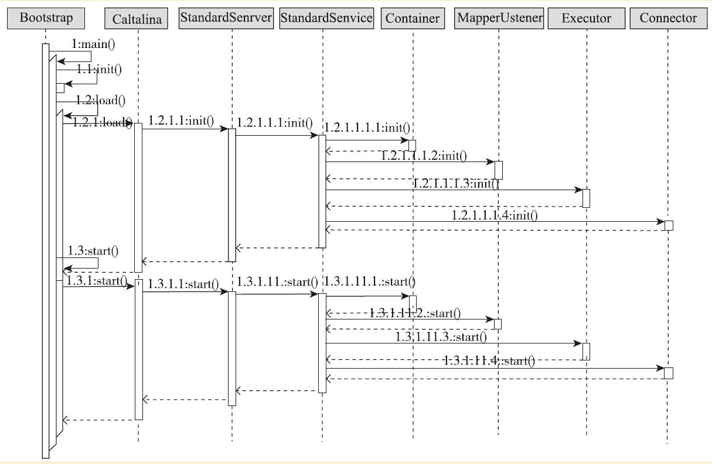

# Tomcat

## Tomcat 的顶层结构及启动过程

## Tomcat 的顶层结构

Tomcat 中最顶层的容器叫Server， 代表整个服务器， Server 中包含至少一个 Service， 用于具体提供服务。

Service 主要包含两部分： Connector 和 Container
* Connector 用于处理连接相关的事情，并提供 Socket 与 request、 response 的转换；
* Container 用于封装和管理 Servlet，以及具体处理 request 请求。 

一个 Tomcat 中只有一个 Server， 一个 Server 可以包含多个 Service， 一个 Service 只有一个 Container，但可以有多个 Connectors

Tomcat 里的 Server 由 `org.apache.catalina.startup.Catalina` 来管理，`Catalina` 是整个 Tomcat 的管理类， 它里面的三个方法 `load`、 `start`、 `stop` 分别用来管理整个服务器的生命周期。

* `load` 方法用于根据 `conf/server.xml` 文件创建 Server 并调用 Server 的 `init` 方法进行初始化；
* `start` 方法用于启动服务器；
* `stop` 方法用于停止服务器；

`start` 和 `stop` 方法在内部分别调用了 Server 的 `start` 和 `stop` 方法， `load` 方法内部调用了 Server 的 `init` 方法，这三个方法都会按容器的结构逐层调用相应的方法，`Catalina` 还有个方法也很重要，那就是 `await` 方法，`Catalina` 中的 `await` 方法直接调用了 Server 的 `await` 方法，这个方法的作用是进入一个循环，让主线程不会退出。

Tomcat 的入口 `main` 方法在 `org. pache.catalina.startup.Bootstrap` 中。 `Bootstrap` 的作用类似一个 `CatalinaAdaptor`， 具体处理过程还是使用`Catalina` 来完成的， 这么做的好处是可以把启动的入口和具体的管理类分开，从而可以很方便地创建出多种启动方式，每种启动方式只需要写一个相应的 `CatalinaAdaptor`就可以了。

## `Bootstrap` 启动过程

`Bootstrap` 是 Tomcat 的入口，正常情况下启动 Tomcat 就是调用 `Bootstrap` 的 `main` 方法。

```java
public static void main(String args[]) {

    synchronized (daemonLock) {
        if (daemon == null) {
            // Don't set daemon until init() has completed
            Bootstrap bootstrap = new Bootstrap();
            try {
                // 初始化 ClassLoader，并用 ClassLoader 创建了 Catalina 实例，赋值给 catalinaDaemon
                bootstrap.init();
            } catch (Throwable t) {
                handleThrowable(t);
                t.printStackTrace();
                return;
            }
            daemon = bootstrap;
        } else {
            // When running as a service the call to stop will be on a new
            // thread so make sure the correct class loader is used to
            // prevent a range of class not found exceptions.
            Thread.currentThread().setContextClassLoader(daemon.catalinaLoader);
        }
    }

    try {
        String command = "start";
        if (args.length > 0) {
            command = args[args.length - 1];
        }

        if (command.equals("startd")) {
            args[args.length - 1] = "start";
            daemon.load(args);
            daemon.start();
        } else if (command.equals("stopd")) {
            args[args.length - 1] = "stop";
            daemon.stop();
        } else if (command.equals("start")) {
            daemon.setAwait(true);
            daemon.load(args);
            daemon.start();
        } else if (command.equals("stop")) {
            daemon.stopServer(args);
        } else if (command.equals("configtest")) {
            daemon.load(args);
            if (null==daemon.getServer()) {
                System.exit(1);
            }
            System.exit(0);
        } else {
            log.warn("Bootstrap: command \"" + command + "\" does not exist.");
        }
    } catch (Throwable t) {
        // Unwrap the Exception for clearer error reporting
        if (t instanceof InvocationTargetException &&
                t.getCause() != null) {
            t = t.getCause();
        }
        handleThrowable(t);
        t.printStackTrace();
        System.exit(1);
    }

}
```

## `Catalina` 启动过程

`Catalina` 的启动主要是调用 `setAwait` 、`load` 和 `start` 方法来完成。

