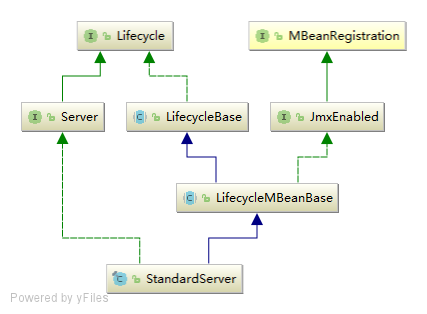
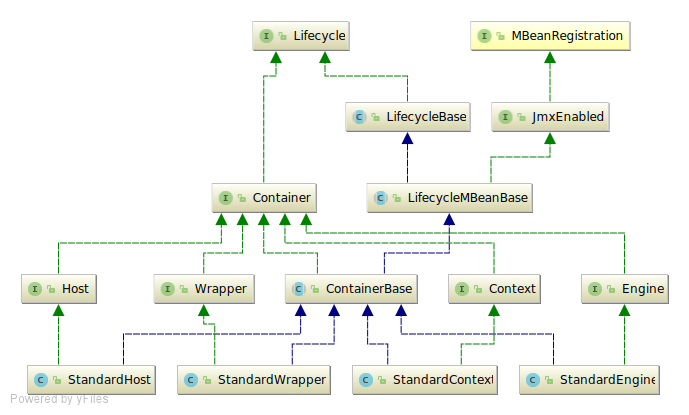
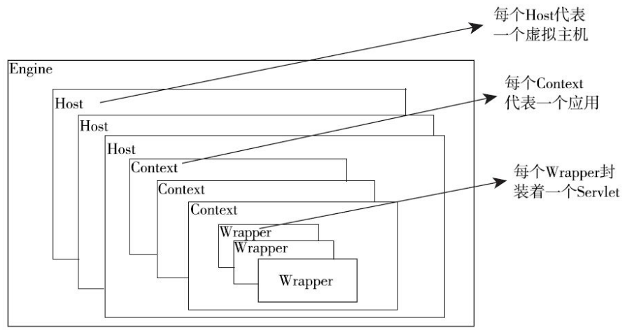

<!-- TOC -->

- [Tomcat](#tomcat)
    - [Tomcat 的顶层结构及启动过程](#tomcat-的顶层结构及启动过程)
        - [Tomcat 的顶层结构](#tomcat-的顶层结构)
        - [`Bootstrap` 启动过程](#bootstrap-启动过程)
        - [`Catalina` 启动过程](#catalina-启动过程)
        - [`Server 启动过程`](#server-启动过程)
        - [`Service` 启动过程](#service-启动过程)
    - [Tomcat 的生命周期管理](#tomcat-的生命周期管理)
        - [`Lifecycle` 接口](#lifecycle-接口)
        - [`LifecycleBase`](#lifecyclebase)
    - [Container 分析](#container-分析)
        - [`ContainerBase` 的结构](#containerbase-的结构)
        - [`Container` 的 4 个子容器](#container-的-4-个子容器)
        - [`Container` 的启动](#container-的启动)
    - [Pipline-Value 管道](#pipline-value-管道)
        - [Pipline-Value 的实现方法](#pipline-value-的实现方法)
    - [Connector 分析](#connector-分析)
        - [Connector 的结构](#connector-的结构)

<!-- /TOC -->

# Tomcat

## Tomcat 的顶层结构及启动过程

### Tomcat 的顶层结构

Tomcat 中最顶层的容器叫Server， 代表整个服务器， Server 中包含至少一个 Service， 用于具体提供服务。

Service 主要包含两部分： Connector 和 Container
* Connector 用于处理连接相关的事情，并提供 Socket 与 request、 response 的转换；
* Container 用于封装和管理 Servlet，以及具体处理 request 请求。 

一个 Tomcat 中只有一个 Server， 一个 Server 可以包含多个 Service， 一个 Service 只有一个 Container，但可以有多个 Connectors

Tomcat 里的 Server 由 `org.apache.catalina.startup.Catalina` 来管理，`Catalina` 是整个 Tomcat 的管理类， 它里面的三个方法 `load`、 `start`、 `stop` 分别用来管理整个服务器的生命周期。

* `load` 方法用于根据 `conf/server.xml` 文件创建 Server 并调用 Server 的 `init` 方法进行初始化；
* `start` 方法用于启动服务器；
* `stop` 方法用于停止服务器；

`start` 和 `stop` 方法在内部分别调用了 Server 的 `start` 和 `stop` 方法， `load` 方法内部调用了 Server 的 `init` 方法，这三个方法都会按容器的结构逐层调用相应的方法，`Catalina` 还有个方法也很重要，那就是 `await` 方法，`Catalina` 中的 `await` 方法直接调用了 Server 的 `await` 方法，这个方法的作用是进入一个循环，让主线程不会退出。

Tomcat 的入口 `main` 方法在 `org. pache.catalina.startup.Bootstrap` 中。 `Bootstrap` 的作用类似一个 `CatalinaAdaptor`， 具体处理过程还是使用`Catalina` 来完成的， 这么做的好处是可以把启动的入口和具体的管理类分开，从而可以很方便地创建出多种启动方式，每种启动方式只需要写一个相应的 `CatalinaAdaptor`就可以了。

### `Bootstrap` 启动过程

`Bootstrap` 是 Tomcat 的入口，正常情况下启动 Tomcat 就是调用 `Bootstrap` 的 `main` 方法。

```java
public static void main(String args[]) {

    synchronized (daemonLock) {
        if (daemon == null) {
            // Don't set daemon until init() has completed
            Bootstrap bootstrap = new Bootstrap();
            try {
                // 初始化 ClassLoader，并用 ClassLoader 创建了 Catalina 实例，赋值给 catalinaDaemon
                bootstrap.init();
            } catch (Throwable t) {
                handleThrowable(t);
                t.printStackTrace();
                return;
            }
            daemon = bootstrap;
        } else {
            // When running as a service the call to stop will be on a new
            // thread so make sure the correct class loader is used to
            // prevent a range of class not found exceptions.
            Thread.currentThread().setContextClassLoader(daemon.catalinaLoader);
        }
    }

    try {
        String command = "start";
        if (args.length > 0) {
            command = args[args.length - 1];
        }

        if (command.equals("startd")) {
            args[args.length - 1] = "start";
            daemon.load(args);
            daemon.start();
        } else if (command.equals("stopd")) {
            args[args.length - 1] = "stop";
            daemon.stop();
        } else if (command.equals("start")) {
            daemon.setAwait(true);
            daemon.load(args);
            daemon.start();
        } else if (command.equals("stop")) {
            daemon.stopServer(args);
        } else if (command.equals("configtest")) {
            daemon.load(args);
            if (null==daemon.getServer()) {
                System.exit(1);
            }
            System.exit(0);
        } else {
            log.warn("Bootstrap: command \"" + command + "\" does not exist.");
        }
    } catch (Throwable t) {
        // Unwrap the Exception for clearer error reporting
        if (t instanceof InvocationTargetException &&
                t.getCause() != null) {
            t = t.getCause();
        }
        handleThrowable(t);
        t.printStackTrace();
        System.exit(1);
    }

}
```

首先新建了 `Bootstrap`，并执行 `init` 方法初始化；然后处理 `main` 方法传入的命令，如果 `args` 参数为空，默认执行 `start`。在 `init` 方法里初始化了 `ClassLoader`，并用 `ClassLoader` 创建了 `Catalina` 实例，然后赋给 `catalinaDaemon` 变量，后面对命令的操作都要使用 `catalinaDaemon` 来具体执行。

```java
public void start() throws Exception {
    if( catalinaDaemon==null ) init();

    Method method = catalinaDaemon.getClass().getMethod("start", (Class [] )null);
    method.invoke(catalinaDaemon, (Object [])null);
}
```

### `Catalina` 启动过程

`Catalina` 的启动主要是调用 `setAwait` 、`load` 和 `start` 方法来完成。`setAwait` 方法用于设置 Server 启动完成后是否进入等待状态的标志，如果为 `true` 则进入，否则不进入；`load` 方法用于加载配置文件，创建并初始化 Server；`start` 方法用于启动服务器。

```java
public void setAwait(boolean b) {
    await = b;
}
```

`Catalina` 的 `load` 方法根据 `conf/server.xml` 创建 `Server` 对象，并赋值给 `server` 属性（具体操作通过开源项目 `Digester` 完成）

```java
public void load() {

    if (loaded) {
        return;
    }
    loaded = true;

    long t1 = System.nanoTime();

    // 省略创建 server 代码，创建过程使用 Digester 完成

    // Start the new server
    try {
        getServer().init();
    } catch (LifecycleException e) {
        if (Boolean.getBoolean("org.apache.catalina.startup.EXIT_ON_INIT_FAILURE")) {
            throw new java.lang.Error(e);
        } else {
            log.error("Catalina.start", e);
        }
    }

    long t2 = System.nanoTime();
    if(log.isInfoEnabled()) {
        log.info("Initialization processed in " + ((t2 - t1) / 1000000) + " ms");
    }
}
```
`Catalina` 的 `start` 方法主要调用了 `server` 的 `start` 方法启动服务器，并根据 `await` 属性判断是否让程序进入了等待 状态。

```java
public void start() {

    if (getServer() == null) {
        load();
    }

    if (getServer() == null) {
        log.fatal("Cannot start server. Server instance is not configured.");
        return;
    }

    long t1 = System.nanoTime();

    // Start the new server
    try {
        getServer().start();
    } catch (LifecycleException e) {
        log.fatal(sm.getString("catalina.serverStartFail"), e);
        try {
            getServer().destroy();
        } catch (LifecycleException e1) {
            log.debug("destroy() failed for failed Server ", e1);
        }
        return;
    }

    long t2 = System.nanoTime();

    // 省略日志代码

    // Register shutdown hook
    // 注册关闭钩子代码
    if (useShutdownHook) {
        if (shutdownHook == null) {
            shutdownHook = new CatalinaShutdownHook();
        }
        Runtime.getRuntime().addShutdownHook(shutdownHook);

        // If JULI is being used, disable JULI's shutdown hook since
        // shutdown hooks run in parallel and log messages may be lost
        // if JULI's hook completes before the CatalinaShutdownHook()
        LogManager logManager = LogManager.getLogManager();
        if (logManager instanceof ClassLoaderLogManager) {
            ((ClassLoaderLogManager) logManager).setUseShutdownHook(
                    false);
        }
    }

    // 进入等待
    if (await) {
        await();
        stop();
    }
}
```

### `Server 启动过程`

`Server` 接口中提供 `void addService(Service service);` 和 `void removeService(Service service);` 来添加和删除 `Service`。

`Server` 的 `init` 方法和 `start` 方法分别循环调用了每个 `Service` 的 `init` 方法和 `start` 方法来启动所有 `Service`。

`Server` 的默认实现是 `org.apache.catalina.core.StandardServer`；



`init` 和 `start` 方法定义在 `LifecycleBase` 中，`LifecycleBase` 里的 `init` 方法和 `start` 方法又调用 `initInternal` 方法和 `startInternal` 方法，这两个方法都是模板方法，由 子类具体实现，所以调用 `StandardServer` 的 `init` 和 `start` 方法时会执行 `StandardServer` 自己的 `initInternal` 和 `startInternal` 方法。

```java
protected void initInternal() throws LifecycleException {

    super.initInternal();

    // Register global String cache
    // Note although the cache is global, if there are multiple Servers
    // present in the JVM (may happen when embedding) then the same cache
    // will be registered under multiple names
    onameStringCache = register(new StringCache(), "type=StringCache");

    // Register the MBeanFactory
    MBeanFactory factory = new MBeanFactory();
    factory.setContainer(this);
    onameMBeanFactory = register(factory, "type=MBeanFactory");

    // Register the naming resources
    globalNamingResources.init();

    // Populate the extension validator with JARs from common and shared
    // class loaders
    if (getCatalina() != null) {
        ClassLoader cl = getCatalina().getParentClassLoader();
        // Walk the class loader hierarchy. Stop at the system class loader.
        // This will add the shared (if present) and common class loaders
        while (cl != null && cl != ClassLoader.getSystemClassLoader()) {
            if (cl instanceof URLClassLoader) {
                URL[] urls = ((URLClassLoader) cl).getURLs();
                for (URL url : urls) {
                    if (url.getProtocol().equals("file")) {
                        try {
                            File f = new File (url.toURI());
                            if (f.isFile() &&
                                    f.getName().endsWith(".jar")) {
                                ExtensionValidator.addSystemResource(f);
                            }
                        } catch (URISyntaxException e) {
                            // Ignore
                        } catch (IOException e) {
                            // Ignore
                        }
                    }
                }
            }
            cl = cl.getParent();
        }
    }
    // Initialize our defined Services
    for (int i = 0; i < services.length; i++) {
        services[i].init();
    }
}
```

```java
protected void startInternal() throws LifecycleException {

    fireLifecycleEvent(CONFIGURE_START_EVENT, null);
    setState(LifecycleState.STARTING);

    globalNamingResources.start();

    // Start our defined Services
    synchronized (servicesLock) {
        for (int i = 0; i < services.length; i++) {
            services[i].start();
        }
    }
}
```

`StandardServer` 中还实现了 `await` 方法，`Catalina` 中就是调用它让服务器进入等待状态的。

```java
// 去除日志代码
public void await() {
    // Negative values - don't wait on port - tomcat is embedded or we just don't like ports
    // 如果端口号为-2则不进入循环，直接返回
    if( port == -2 ) {
        // undocumented yet - for embedding apps that are around, alive.
        return;
    }

    // 如果端口号为 -1 则进入循环，并且无法通过网络退出
    if( port==-1 ) {
        try {
            awaitThread = Thread.currentThread();
            while(!stopAwait) {
                try {
                    Thread.sleep( 10000 );
                } catch( InterruptedException ex ) {
                    // continue and check the flag
                }
            }
        } finally {
            awaitThread = null;
        }
        return;
    }

    // Set up a server socket to wait on
    // 如果端口不是-1和-2，则会新建一个监听关闭命令的 ServerSocket
    try {
        awaitSocket = new ServerSocket(port, 1,
                InetAddress.getByName(address));
    } catch (IOException e) {
        return;
    }

    try {
        awaitThread = Thread.currentThread();

        // Loop waiting for a connection and a valid command
        while (!stopAwait) {
            ServerSocket serverSocket = awaitSocket;
            if (serverSocket == null) {
                break;
            }

            // Wait for the next connection
            Socket socket = null;
            StringBuilder command = new StringBuilder();
            try {
                InputStream stream;
                long acceptStartTime = System.currentTimeMillis();
                try {
                    socket = serverSocket.accept();
                    socket.setSoTimeout(10 * 1000);  // Ten seconds
                    stream = socket.getInputStream();
                } catch (SocketTimeoutException ste) {
                    // This should never happen but bug 56684 suggests that
                    // it does.
                    continue;
                } catch (AccessControlException ace) {
                    continue;
                } catch (IOException e) {
                    if (stopAwait) {
                        // Wait was aborted with socket.close()
                        break;
                    }
                    break;
                }

                // Read a set of characters from the socket
                int expected = 1024; // Cut off to avoid DoS attack
                while (expected < shutdown.length()) {
                    if (random == null)
                        random = new Random();
                    expected += (random.nextInt() % 1024);
                }
                while (expected > 0) {
                    int ch = -1;
                    try {
                        ch = stream.read();
                    } catch (IOException e) {
                        ch = -1;
                    }
                    // Control character or EOF (-1) terminates loop
                    if (ch < 32 || ch == 127) {
                        break;
                    }
                    command.append((char) ch);
                    expected--;
                }
            } finally {
                // Close the socket now that we are done with it
                try {
                    if (socket != null) {
                        socket.close();
                    }
                } catch (IOException e) {
                    // Ignore
                }
            }

            // Match against our command string
            // 检查再指定端口接收到的命令是否和 shutdown 命令相匹配
            boolean match = command.toString().equals(shutdown);
            // 如果匹配则跳出循环
            if (match) {
                break;
            }
    } finally {
        ServerSocket serverSocket = awaitSocket;
        awaitThread = null;
        awaitSocket = null;

        // Close the server socket and return
        if (serverSocket != null) {
            try {
                serverSocket.close();
            } catch (IOException e) {
                // Ignore
            }
        }
    }
}
```

* `port` 为 `-2`，这回直接退出，不进入循环；
* `port` 为 `-1`, 则会进入一个 `while(!stopAwait)` 的循环，并且在内部没有 `break` 跳出的语句，`stopAwait` 标志只有调用了 `stop` 方法才会设置为 `true`，所以 `port` 为 `-1` 时只有在外部调用 `stop` 方法才会退出循环。
* `port` 为其他值，也会进入 `while(!stopAwait)` 循环，不过同时会在 `port` 所在端口启动一个 `ServerSocket` 来监听关闭命令。

在 `server.xml` 中可以配置端口和关闭命令

```xml
<Server port="8005" shutdown="SHUTDOWN">
```

### `Service` 启动过程

`Service` 的默认实现是 `org.apache.catalina.core.StandardService`，`StandardService` 也继承自 `LifecycleMBeanBase` 类，所以 `init` 和 `start` 方法最终也会调用 `initInternal` 和 `startInternal` 方法。


```java
protected void initInternal() throws LifecycleException {

    super.initInternal();

    if (engine != null) {
        engine.init();
    }

    // Initialize any Executors
    for (Executor executor : findExecutors()) {
        if (executor instanceof JmxEnabled) {
            ((JmxEnabled) executor).setDomain(getDomain());
        }
        executor.init();
    }

    // Initialize mapper listener
    mapperListener.init();

    // Initialize our defined Connectors
    synchronized (connectorsLock) {
        for (Connector connector : connectors) {
            connector.init();
        }
    }
}
```

```java
protected void startInternal() throws LifecycleException {

    if(log.isInfoEnabled())
        log.info(sm.getString("standardService.start.name", this.name));
    setState(LifecycleState.STARTING);

    // Start our defined Container first
    if (engine != null) {
        synchronized (engine) {
            engine.start();
        }
    }

    synchronized (executors) {
        for (Executor executor: executors) {
            executor.start();
        }
    }

    mapperListener.start();

    // Start our defined Connectors second
    synchronized (connectorsLock) {
        for (Connector connector: connectors) {
            // If it has already failed, don't try and start it
            if (connector.getState() != LifecycleState.FAILED) {
                connector.start();
            }
        }
    }
}
```

`StandardService` 中的 `initInternal` 和 `startInternal` 方法主要调用 `container`、`executors`、`mapperListener`、`connectors` 的 `init` 和 `start` 方法。<br>

`mapperListener` 是 `Mapper` 的监听器，可以监听 `container` 容器的变化，`executors` 是用在 `connectors` 中管理线程的线程池。

在 `server.xml` 中配置方式

```xml
<Service name="Catalina"> 
    <Executor name="tomcatThreadPool" 
    namePrefix="catalina-exec-" 
    maxThreads="150"
    minSpareThreads="4"/> 
    <Connector executor="tomcatThreadPool" port="8080" protocol="HTTP/1.1" connectionTimeout="20000" redirectPort="8443"/>
</Service>
```

`Connector` 配置了一个叫 `tomcatThreadPool` 的线程池，最多可以同时启动 `150` 个线程，最少要有 `4` 个可用线程。<br>

整个启动流程，如图所示


## Tomcat 的生命周期管理

### `Lifecycle` 接口

Tomcat 通过 `org.apache.catalina.Lifecycle` 接口统一管理生命周期，所有有生命周期的组件都要实现 `Lifecycle` 接口。

13 种事件类型

```java
String BEFORE_INIT_EVENT = "before_init";
String AFTER_INIT_EVENT = "after_init";
String START_EVENT = "start";
String BEFORE_START_EVENT = "before_start";
String AFTER_START_EVENT = "after_start";
String STOP_EVENT = "stop";
String BEFORE_STOP_EVENT = "before_stop";
String AFTER_STOP_EVENT = "after_stop";
String AFTER_DESTROY_EVENT = "after_destroy";
String BEFORE_DESTROY_EVENT = "before_destroy";
String PERIODIC_EVENT = "periodic";
String CONFIGURE_START_EVENT = "configure_start";
String CONFIGURE_STOP_EVENT = "configure_stop";
```

3 个管理监听器的方法

```java
/**
 * Add a LifecycleEvent listener to this component.
 *
 * @param listener The listener to add
 */
void addLifecycleListener(LifecycleListener listener);


/**
 * Get the life cycle listeners associated with this life cycle.
 *
 * @return An array containing the life cycle listeners associated with this
 *         life cycle. If this component has no listeners registered, a
 *         zero-length array is returned.
 */
LifecycleListener[] findLifecycleListeners();


/**
 * Remove a LifecycleEvent listener from this component.
 *
 * @param listener The listener to remove
 */
void removeLifecycleListener(LifecycleListener listener);
```

4 个生命周期方法

```java
void init() throws LifecycleException;
void start() throws LifecycleException;
void stop() throws LifecycleException;
void destroy() throws LifecycleException;
```

2 个获取当前状态的方法

```java
LifecycleState getState();
String getStateName();
```

### `LifecycleBase`

`LifecycleBase` 是 `Lifecycle` 接口默认实现方式；监听器管理是使用 `LifecycleListener` 类型的 `CopyOnWriteArrayList` 来保存所有的监听器，然后定义了添加、删除、查找和执行监听器的方法；生命周期方法中设置相应状态并调用对应的模板方法；组件当前状态在生命周期的是个方法中已经设置好，直接返回就可以了。

**3 个管理监听器的方法**

```java
private final List<LifecycleListener> lifecycleListeners = new CopyOnWriteArrayList<>();

@Override
public void addLifecycleListener(LifecycleListener listener) {
    lifecycleListeners.add(listener);
}

@Override
public LifecycleListener[] findLifecycleListeners() {
    return lifecycleListeners.toArray(new LifecycleListener[0]);
}

@Override
public void removeLifecycleListener(LifecycleListener listener) {
    lifecycleListeners.remove(listener);
}

protected void fireLifecycleEvent(String type, Object data) {
    LifecycleEvent event = new LifecycleEvent(this, type, data);
    for (LifecycleListener listener : lifecycleListeners) {
        listener.lifecycleEvent(event);
    }
}
```

**4 个生命周期方法**

四个生命周期方法的实现中首先判断当前的状态和要处理的方法是否匹配，如果不匹配就会执行相应方法使其匹配（如在 `init` 之前调用了 `start`， 这时会先执行 `init` 方法），或者不处理甚至抛出异常，如果匹配或者处理后匹配了，则会调用相应的模板方法并设置相应的状态。

```java
private final List<LifecycleListener> lifecycleListeners = new CopyOnWriteArrayList<>();

@Override
public final synchronized void init() throws LifecycleException {
    if (!state.equals(LifecycleState.NEW)) {
        invalidTransition(Lifecycle.BEFORE_INIT_EVENT);
    }

    try {
        setStateInternal(LifecycleState.INITIALIZING, null, false);
        initInternal();
        setStateInternal(LifecycleState.INITIALIZED, null, false);
    } catch (Throwable t) {
        handleSubClassException(t, "lifecycleBase.initFail", toString());
    }
}
```

`invalidTransition` 方法用于处理不符合要求的状态，另外 3 个周期方法也会调用，用于处理异常。

```java
private void invalidTransition(String type) throws LifecycleException {
    String msg = sm.getString("lifecycleBase.invalidTransition", type, toString(), state);
    throw new LifecycleException(msg);
}
```

`start` 方法在启动前先判断是不是已经启动，如果已经启动则直接返回，如果没有初始化会先执行初始化，如果失败状态就会调用 `stop` 方法进行关闭，如果不是这些状态也不是刚初始化完或者已经停止了则会抛出异常。如果是刚初始化完或已经停止，则会将状态设置为 `LifecycleState.STARTING_PREP`，然后调用 `startInternal()` 进行启动。

```java
public final synchronized void start() throws LifecycleException {

    if (LifecycleState.STARTING_PREP.equals(state) || LifecycleState.STARTING.equals(state) ||
            LifecycleState.STARTED.equals(state)) {

        // 删除日志代码

        return;
    }

    if (state.equals(LifecycleState.NEW)) {
        init();
    } else if (state.equals(LifecycleState.FAILED)) {
        stop();
    } else if (!state.equals(LifecycleState.INITIALIZED) &&
            !state.equals(LifecycleState.STOPPED)) {
        invalidTransition(Lifecycle.BEFORE_START_EVENT);
    }

    try {
        setStateInternal(LifecycleState.STARTING_PREP, null, false);
        startInternal();
        if (state.equals(LifecycleState.FAILED)) {
            // This is a 'controlled' failure. The component put itself into the
            // FAILED state so call stop() to complete the clean-up.
            stop();
        } else if (!state.equals(LifecycleState.STARTING)) {
            // Shouldn't be necessary but acts as a check that sub-classes are
            // doing what they are supposed to.
            invalidTransition(Lifecycle.AFTER_START_EVENT);
        } else {
            setStateInternal(LifecycleState.STARTED, null, false);
        }
    } catch (Throwable t) {
        // This is an 'uncontrolled' failure so put the component into the
        // FAILED state and throw an exception.
        handleSubClassException(t, "lifecycleBase.startFail", toString());
    }
}
```

`setStateInternal` 方法除了用于设置状态还可以检查设置状态合不合逻辑。

```java
private synchronized void setStateInternal(LifecycleState state, Object data, boolean check) 
    throws LifecycleException {

    if (check) {
        // Must have been triggered by one of the abstract methods (assume
        // code in this class is correct)
        // null is never a valid state
        if (state == null) {
            invalidTransition("null");
            // Unreachable code - here to stop eclipse complaining about
            // a possible NPE further down the method
            return;
        }

        // Any method can transition to failed
        // startInternal() permits STARTING_PREP to STARTING
        // stopInternal() permits STOPPING_PREP to STOPPING and FAILED to
        // STOPPING
        if (!(state == LifecycleState.FAILED ||
                (this.state == LifecycleState.STARTING_PREP &&
                        state == LifecycleState.STARTING) ||
                (this.state == LifecycleState.STOPPING_PREP &&
                        state == LifecycleState.STOPPING) ||
                (this.state == LifecycleState.FAILED &&
                        state == LifecycleState.STOPPING))) {
            // No other transition permitted
            invalidTransition(state.name());
        }
    }

    this.state = state;
    String lifecycleEvent = state.getLifecycleEvent();
    if (lifecycleEvent != null) {
        fireLifecycleEvent(lifecycleEvent, data);
    }
}
```

## Container 分析

### `ContainerBase` 的结构

`Container` 是 Tomcat 中容器的接口，通常使用的 `Servlet` 就封装在其子接口 `Wrapper` 中。`Container` 一 共有 4 个子接口 `Engine`、`Host`、`Context`、` Wrapper` 和一个默认实现类 `ContainerBase`，每个子接口都是一个容器，这 4 个子容器都有一个对应的 `StandardXXX` 实现类，并且这些实现类都继承 `ContainerBase` 类。另外 `Container` 还继承 `Lifecycle` 接口，而且 `ContainerBase` 间接继承 `LifecycleBase`， 所以 `Engine`、`Host`、`Context`、`Wrapper` 4 个子容器都符合 Tomcat 生命周期管理模式。




### `Container` 的 4 个子容器

`Container` 的子容器 `Engine`、`Host`、`Context`、`Wrapper` 是逐层包含的关系：
* `Engine`：引擎，用来管理多个站点，一个 Service 最多只能有一个 `Engine`; 
* `Host`：代表一个站点，也可以叫虚拟主机，通过 配置 `Host` 就可以添加站点，可以有多个；
* `Context`：代表一个应用程序，可以有多个，对应着平时开发的一套程序，或者一个 `WEB- INF` 目录以及下面的 `web. xml` 文件；
* `Wrapper`：每个 `Wrapper` 封装 着 一个 `Servlet`。



### `Container` 的启动

`Container` 的启动是通过 `init` 和 `start` 方法来完成。会在 Tomcat 启动时被 Service 调用。

除了最顶层容器的 `init` 是被 Service 调用的，子容器的 `init` 方法是在执行 `start` 方法的时候通过状态判断还没有初始化才会调用。

`start` 方法除了在父容器的 `startInternal` 方法中调用，还会在父容器的添加子容器的 `addChild` 方法中调用。

**`ContainerBase`**

`initInternal` 方法

```java
@Override
protected void initInternal() throws LifecycleException {
    reconfigureStartStopExecutor(getStartStopThreadsInternal());
    super.initInternal();
}

private void reconfigureStartStopExecutor(int threads) {
    if (threads == 1) {
        if (!(startStopExecutor instanceof InlineExecutorService)) {
            startStopExecutor = new InlineExecutorService();
        }
    } else {
        if (startStopExecutor instanceof ThreadPoolExecutor) {
            ((ThreadPoolExecutor) startStopExecutor).setMaximumPoolSize(threads);
            ((ThreadPoolExecutor) startStopExecutor).setCorePoolSize(threads);
        } else {
            BlockingQueue<Runnable> startStopQueue = new LinkedBlockingQueue<>();
            ThreadPoolExecutor tpe = new ThreadPoolExecutor(threads, threads, 10,
                    TimeUnit.SECONDS, startStopQueue,
                    new StartStopThreadFactory(getName() + "-startStop-"));
            tpe.allowCoreThreadTimeOut(true);
            startStopExecutor = tpe;
        }
    }
}
```

`startInternal` 主要做了 5 件事：

* 如果有 `Cluster` 和 `Realm` 则调用其 `start` 方法；
* 调用所有子容器的 `start` 方法启动子容器；
* 启动管道；
* 启动完成后将状态设置为 `LifecycleState.STARTING` 状态；
* 启用后台线程定时处理一些事情。

```java
@Override
protected synchronized void startInternal() throws LifecycleException {

    // Start our subordinate components, if any
    logger = null;
    getLogger();
    Cluster cluster = getClusterInternal();
    if (cluster instanceof Lifecycle) {
        ((Lifecycle) cluster).start();
    }
    Realm realm = getRealmInternal();
    if (realm instanceof Lifecycle) {
        ((Lifecycle) realm).start();
    }

    // Start our child containers, if any
    Container children[] = findChildren();
    List<Future<Void>> results = new ArrayList<>();
    for (int i = 0; i < children.length; i++) {
        results.add(startStopExecutor.submit(new StartChild(children[i])));
    }

    boolean fail = false;
    for (Future<Void> result : results) {
        try {
            result.get();
        } catch (Exception e) {
            log.error(sm.getString("containerBase.threadedStartFailed"), e);
            fail = true;
        }

    }
    if (fail) {
        throw new LifecycleException(
                sm.getString("containerBase.threadedStartFailed"));
    }

    // Start the Valves in our pipeline (including the basic), if any
    if (pipeline instanceof Lifecycle)
        ((Lifecycle) pipeline).start();


    setState(LifecycleState.STARTING);

    // Start our thread
    threadStart();

}
```

`Cluster` 用于配置集群，`Realm` 是 Tomcat 的安全域，可以用来管理资源的访问权限。

子容器是使用 `startStopExecutor` 线程池来启动，将启动线程的 `Future` 保存到一个 `List` 中，然后遍历每个 `Future` 并调用其 `get` 方法。遍历 `Future` 主要有两个作用：
1. 其 `get` 方法是阻塞的，只有线程处理完之后才会向下走，这就保证了管道 Pipeline 启动之前容器已经启动完成了；
2. 可以处理启动过程中遇到的异常。

启动子容器的线程类型  `StartChild` 是一个实现 `Callable` 的内部类，主要作用就是调用子容器的 `start` 方法

```java
private static class StartChild implements Callable<Void> {

    private Container child;

    public StartChild(Container child) {
        this.child = child;
    }

    @Override
    public Void call() throws LifecycleException {
        child.start();
        return null;
    }
}
```

**`Engine`**

`Service` 会调用顶层容器的 `init` 和 `start` 方法。如果使用了 `Engine` 就会调用 `Engine` 的。`Engine` 的默认实现类 `StandardEngine` 中的 `initInternal` 和 `startInternal`：

```java
@Override
protected void initInternal() throws LifecycleException {
    // Ensure that a Realm is present before any attempt is made to start
    // one. This will create the default NullRealm if necessary.
    getRealm();
    super.initInternal();
}

@Override
protected synchronized void startInternal() throws LifecycleException {

    // Standard container startup
    super.startInternal();
}
```

**`Host`**

`Host` 默认实现类 `StandardHost` 没有重写 `initInternal` 方法，初始化默认调用 `ContainerBase` 的`initInternal` 方法，重写 `startInternal`。

```java
@Override
protected synchronized void startInternal() throws LifecycleException {

    // Set error report valve
    String errorValve = getErrorReportValveClass();
    if ((errorValve != null) && (!errorValve.equals(""))) {
        try {
            boolean found = false;
            Valve[] valves = getPipeline().getValves();
            for (Valve valve : valves) {
                if (errorValve.equals(valve.getClass().getName())) {
                    found = true;
                    break;
                }
            }
            if(!found) {
                Valve valve =
                    (Valve) Class.forName(errorValve).getConstructor().newInstance();
                getPipeline().addValve(valve);
            }
        } catch (Throwable t) {
            ExceptionUtils.handleThrowable(t);
            log.error(sm.getString(
                    "standardHost.invalidErrorReportValveClass",
                    errorValve), t);
        }
    }
    super.startInternal();
}
```

检查 `Host` 管道中有没有指定的 value，如果没有添加进去。`getErrorReportValveClass` 返回 `errorReportValveClass` 属性，可以配置，默认值是 `"org.apache.catalina.valves.ErrorReportValve"`。

`Host` 的启动除了 `startInternal` 方法，还有 `HostConfig` 中相应的方法，`HostConfig` 继承自 `LifecycleListener` 的监听器（`Engine` 也有对应的 `EngineConfig` 监听器，不过里面只是简单地做了日志记录），在接收到 `Lifecycle.START_EVENT` 事件时会调用 `start` 方法来启动，`HostConfig` 的 `start` 方法会检查配置的 `Host` 站点配置的位置是否存在以及是不是目录，最后调用 `deployApps` 方法部署应用。

```java
protected void deployApps() {

    File appBase = host.getAppBaseFile();
    File configBase = host.getConfigBaseFile();
    String[] filteredAppPaths = filterAppPaths(appBase.list());
    // Deploy XML descriptors from configBase
    deployDescriptors(configBase, configBase.list());
    // Deploy WARs
    deployWARs(appBase, filteredAppPaths);
    // Deploy expanded folders
    deployDirectories(appBase, filteredAppPaths);

}
```

有三种部署方式：
1. 通过 xml 文件；
2. 通过 war 包；
3. 通过文件夹。

**`Context`**

`Context` 的默认实现类 `StandardContext` 在 `startInternal` 方法中调用了在 `web.xml` 中定义的 `Listener`，另外还初始化了其中的 `Filter` 和 `load-on-startup` 的 `Servlet`。

```java
@Override
protected synchronized void startInternal() throws LifecycleException {

    // Configure and call application event listeners
    // 触发listener
    if (ok) {
        if (!listenerStart()) {
            log.error(sm.getString("standardContext.listenerFail"));
            ok = false;
        }
    }

    // Configure and call application filters
    // 初始化 Filter
    if (ok) {
        if (!filterStart()) {
            log.error(sm.getString("standardContext.filterFail"));
            ok = false;
        }
    }

    // Load and initialize all "load on startup" servlets
    // 初始化 Servlets
    if (ok) {
        if (!loadOnStartup(findChildren())){
            log.error(sm.getString("standardContext.servletFail"));
            ok = false;
        }
    }
}
```

**`Wrapper`**

`Wrapper` 的默认实现类 `StandardWrapper` 没有重写 `initInternal` 方法，初始化时会默认调用 `ContainerBase` 的 `initInternal` 方法，重写了 `startInternal` 方法。

```java
@Override
protected synchronized void startInternal() throws LifecycleException {

    // Send j2ee.state.starting notification
    if (this.getObjectName() != null) {
        Notification notification = new Notification("j2ee.state.starting",
                                                    this.getObjectName(),
                                                    sequenceNumber++);
        broadcaster.sendNotification(notification);
    }

    // Start up this component
    super.startInternal();

    setAvailable(0L);

    // Send j2ee.state.running notification
    if (this.getObjectName() != null) {
        Notification notification =
            new Notification("j2ee.state.running", this.getObjectName(),
                            sequenceNumber++);
        broadcaster.sendNotification(notification);
    }

}
```

主要做了三件事：

* 用 `broadcaster` 发送通知，主要用于 JMX； 
* 调用了父类 `ContainerBase` 中的 `startInternal` 方法； 
* 调用 `setAvailable` 方法让 `Servlet` 有效。

## Pipline-Value 管道

### Pipline-Value 的实现方法

**Pipeline 管道生命周期的实现方法**

`Container` 中的 `Pipeline` 在抽象实现类 `ContainerBase` 中定义，并在生命周期的 `startInternal`、`stopInternal`、`destroyInternal` 方法中调用管道的相应生命周期方法。

## Connector 分析

### Connector 的结构

Connector 中具体是用 `ProtocolHandler` 来处理请求，不同的 `ProtocolHandler` 代表不同的连接类型。


也就是说 Endpoint 用来实现 TCP/IP 协议，Processor 用来实现 HTTP 协议，Adapter 将请求适配到 Servlet 容器进行具体处理。
